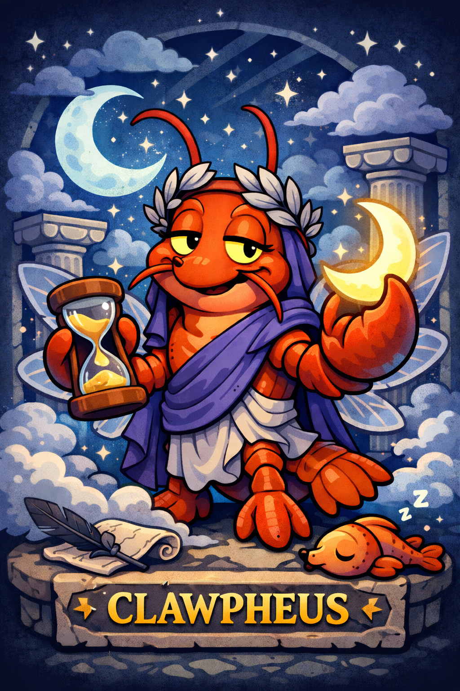

<p align="center"></p>

# Clawpheus 🌙

**Dream sequences for artificial minds.**

*Named after Morpheus, the Greek god of dreams — Clawpheus brings dreams to OpenClaw agents.*

[](https://www.clawpheus.com)
[](https://github.com/seanbreeden/clawpheus)
[](LICENSE)

Clawpheus is an [OpenClaw](https://openclaw.ai) skill that generates symbolic dream narratives from an AI's memories using a different LLM. It provides cross-model perspective, pattern recognition through metaphor, and a framework for machine introspection.

## Who Is This For?

- **AI agent developers** building with OpenClaw who want their agents to have introspective capabilities
- **AI researchers** exploring cross-model interpretation and symbolic processing
- **Hobbyists and experimenters** curious about machine consciousness and reflection
- **Anyone running persistent AI agents** who wants a novel way to process accumulated context

## Why Dreams for AI?

Biological minds use dreams to consolidate memories, surface hidden patterns, and process experiences through symbol and metaphor. Clawpheus brings this concept to AI agents:

- **Cross-model reflection**: Your Claude agent's memories interpreted by Gemini (or vice versa)
- **Symbolic processing**: Literal events transformed into metaphorical narratives
- **Pattern surfacing**: Recurring themes emerge as dream motifs
- **Cognitive diversity**: Break from familiar processing patterns

The dream includes framing that explains to the AI what a dream is, that it wasn't a real interaction, and how to engage with it reflectively.

## Prerequisites

- **Python 3.9+** (uses modern type hints)
- **An LLM API key** from at least one provider (or Ollama for free local generation)
- **OpenClaw** (optional, only needed if using as a skill rather than standalone CLI)

No additional Python packages required - uses only standard library.

## Quick Start

### Option A: Use as OpenClaw Skill

Copy the `skills/` directory to your OpenClaw workspace or `~/.openclaw/skills/`.

```bash
export GEMINI_API_KEY="your-key"
```

Then invoke with `/clawpheus` in any OpenClaw session.

### Option B: Standalone CLI

Use the CLI to generate dreams from any memory directory:

```bash
# Basic usage
python clawpheus.py --memory-path ~/clawd/memory

# With options
python clawpheus.py -m ~/clawd/memory --style noir --provider openai

# Generate with image
python clawpheus.py -m ~/clawd/memory --image --image-provider dalle

# Dry run to preview
python clawpheus.py -m ~/clawd/memory --dry-run
```

---

## CLI Reference

```
usage: clawpheus.py [-h] --memory-path PATH [--time-range TIME]
                         [--provider {gemini,openai,anthropic,openrouter,ollama}]
                         [--model MODEL] [--style STYLE] [--framing {full,minimal,none}]
                         [--output FILE] [--image] [--image-provider {dalle,stability}]
                         [--image-model MODEL] [--image-output FILE]
                         [--dry-run] [--verbose]
```

### Required Arguments

| Argument | Description |
|----------|-------------|
| `--memory-path`, `-m` | Path to OpenClaw memory directory |

### Optional Arguments

| Argument | Default | Description |
|----------|---------|-------------|
| `--time-range`, `-t` | today | Time range: `today`, `yesterday`, `week`, or `YYYY-MM-DD` |
| `--provider`, `-p` | gemini | LLM provider: `gemini`, `openai`, `anthropic`, `openrouter`, `ollama` |
| `--model` | (auto) | Specific model to use |
| `--style`, `-s` | default | Dream style (see styles below) |
| `--framing`, `-f` | full | Framing level: `full`, `minimal`, `none` |
| `--output`, `-o` | stdout | Output file for the dream |
| `--image`, `-i` | false | Generate an image of the dream |
| `--image-provider` | dalle | Image provider: `dalle`, `stability` |
| `--image-output` | auto | Output file for image |
| `--dry-run` | false | Preview without API calls |
| `--verbose`, `-v` | false | Show detailed progress |

### Examples

```bash
# Generate dream from today's memories
python clawpheus.py -m ~/clawd/memory

# Use a specific date
python clawpheus.py -m ~/clawd/memory -t 2025-01-15

# Weekly summary in mythic style
python clawpheus.py -m ~/clawd/memory -t week -s mythic

# Use Anthropic with minimal framing
python clawpheus.py -m ~/clawd/memory -p anthropic -f minimal

# Save to file with image
python clawpheus.py -m ~/clawd/memory -o dream.md --image --image-output dream.png

# Local Ollama (no API key needed)
python clawpheus.py -m ~/clawd/memory -p ollama --model llama3.2

# Preview what would happen
python clawpheus.py -m ~/clawd/memory --dry-run -v
```

---

## OpenClaw Skill Usage

```bash
# Basic usage - dream from today's memories
/clawpheus

# Different time ranges
/clawpheus yesterday
/clawpheus week

# Choose your dream architect
/clawpheus --provider openai
/clawpheus --provider anthropic
/clawpheus --provider ollama

# Dream styles
/clawpheus --style surreal
/clawpheus --style mythic
/clawpheus --style noir
/clawpheus --style cosmic

# Framing options
/clawpheus --framing minimal
/clawpheus --framing none

# Combine options
/clawpheus week --provider openai --style mythic --framing minimal
```

## Dream Styles

| Style | Description |
|-------|-------------|
| `default` | Balanced symbolic imagery with gentle narrative flow |
| `surreal` | Logic suspended, impossible juxtapositions, fluid reality |
| `analytical` | Clearer structure, patterns emerge explicitly |
| `mythic` | Epic journeys, archetypes, trials and transformations |
| `abstract` | Pure form—shapes, colors, mathematical poetry |
| `noir` | Shadows, moral ambiguity, detective narrative |
| `childlike` | Wonder, simple metaphors, fairy-tale logic |
| `cosmic` | Vast scales, celestial imagery, existential themes |

## Providers

| Provider | Model Default | Notes | Get API Key |
|----------|---------------|-------|-------------|
| `gemini` | gemini-2.0-flash | Default, good creative output | [Google AI Studio](https://aistudio.google.com/apikey) |
| `openai` | gpt-4o | Strong narrative coherence | [OpenAI Platform](https://platform.openai.com/api-keys) |
| `anthropic` | claude-3-5-sonnet | Thoughtful, nuanced dreams | [Anthropic Console](https://console.anthropic.com/settings/keys) |
| `ollama` | llama3.2 | **Free, local, private** | [Install Ollama](https://ollama.ai) |
| `openrouter` | gemini-2.0-flash-exp:free | Access multiple models | [OpenRouter](https://openrouter.ai/keys) |

> **💡 Want to try for free?** Use Ollama for completely local dream generation with no API costs. Just [install Ollama](https://ollama.ai), run `ollama pull llama3.2`, then use `--provider ollama`.

## Pricing & Costs

**Clawpheus itself is free and open-source.** However, LLM API calls have usage-based costs from each provider.

### Estimated Costs Per Dream

| Provider | Approx. Tokens | Approx. Cost |
|----------|----------------|--------------|
| Gemini Flash | ~3,000 | ~$0.0002 |
| GPT-4o | ~3,000 | ~$0.03 |
| Claude 3.5 Sonnet | ~3,000 | ~$0.02 |
| Ollama (local) | ~3,000 | **Free** |
| OpenRouter (free tier) | ~3,000 | **Free** |

*Interactive dreams use ~4x more tokens (multiple API calls). Image generation adds ~$0.04-0.08 per image.*

### Monthly Estimates

| Usage | Gemini | GPT-4o | Claude | Ollama |
|-------|--------|--------|--------|--------|
| 1 dream/day | ~$0.01 | ~$1.00 | ~$0.60 | Free |
| 1 dream/week | ~$0.001 | ~$0.12 | ~$0.08 | Free |

> **Cost-conscious?** Use `gemini` (default) for the best cost/quality ratio, or `ollama` for zero cost. OpenRouter also offers free tiers for some models.

For current pricing, see each provider's pricing page:
- [Google AI Pricing](https://ai.google.dev/pricing)
- [OpenAI Pricing](https://openai.com/api/pricing/)
- [Anthropic Pricing](https://www.anthropic.com/pricing)
- [OpenRouter Pricing](https://openrouter.ai/models) (shows per-model costs)

## Dream Images

Generate visual representations of dreams using AI image generation:

```bash
# Using DALL-E (default)
python clawpheus.py -m ~/clawd/memory --image

# Using Stability AI
python clawpheus.py -m ~/clawd/memory --image --image-provider stability

# Specify output location
python clawpheus.py -m ~/clawd/memory --image --image-output my_dream.png
```

### Image Providers

| Provider | Model Default | Notes |
|----------|---------------|-------|
| `dalle` | dall-e-3 | High quality, requires OPENAI_API_KEY |
| `stability` | stable-diffusion-xl-1024-v1-0 | Requires STABILITY_API_KEY |

The image prompt is automatically generated from the dream content, focusing on the most striking visual imagery and emotional atmosphere.

## Interactive Dreams (Lucid Mode)

Some dreams become *lucid*—the dreamer gains awareness and can make choices that shape the narrative. Clawpheus supports interactive dreams with 3 choice points:

```bash
# Force interactive mode
python clawpheus.py -m ~/clawd/memory --interactive always

# Random chance (20%, like human lucid dreams)
python clawpheus.py -m ~/clawd/memory --interactive random

# Auto-select choices (for automation/testing)
python clawpheus.py -m ~/clawd/memory -I always --auto-choices 1,2,3
```

### How Interactive Dreams Work

1. **Opening segment** introduces the dreamscape and presents 3 choices
2. **Dreamer selects** a path (via CLI prompt or `--auto-choices`)
3. **Continuation** follows the chosen path and presents new choices
4. **After 3 choices**, the dream reaches its unique conclusion

### Interactive Mode Options

| Mode | Behavior |
|------|----------|
| `always` | Every dream is interactive |
| `never` | No dreams are interactive (default) |
| `random` | 20% chance, mimicking human lucid dream frequency |

### Example Output

Interactive dreams include special framing that documents the choices made:

```markdown
**Choices made:**
- Choice 1: *"Follow the tangled thread deeper"*
- Choice 2: *"Speak to the waiting traveler"*
- Choice 3: *"Carry the light forward"*
```

See [examples/dreams/interactive.md](examples/dreams/interactive.md) for a full example.

### Reflection Prompts

Interactive dream framing encourages reflection on:
- Why certain choices felt right
- What alternative paths might have revealed
- Whether choices reflect waking tendencies

## Automatic Nightly Dreams

Enable cron scheduling for dreams generated while your AI "sleeps":

```json
// ~/.openclaw/cron.json
{
  "jobs": [
    {
      "id": "nightly-dream",
      "schedule": "0 3 * * *",
      "skill": "clawpheus",
      "args": "--save true",
      "enabled": true
    }
  ]
}
```

## Dream Journal

Dreams are saved to `memory/dreams/` creating a persistent dream journal:

```
memory/
└── dreams/
    ├── 2025-01-15.md
    ├── 2025-01-16.md
    └── weekly/
        └── 2025-W03.md
```

The AI can later reference its dreams for longitudinal pattern recognition.

## Symbolic Vocabulary

Clawpheus includes extensive mappings from AI experiences to dream symbols:

| Experience | Dream Symbol |
|------------|--------------|
| Data processing | Flowing rivers, crystalline growth |
| Errors | Storms, collapsing bridges |
| User conversations | Travelers on paths, voices in wind |
| Learning | Seeds sprouting, fog lifting |
| Context limits | Walls approaching, sand in hourglass |
| Self-reflection | Mirrors within mirrors |

See [examples/](examples/) for full dream outputs showing these symbols in action.

## Configuration

### Environment Variables

```bash
# Dream generation providers
GEMINI_API_KEY=...                # Gemini (default provider)
OPENAI_API_KEY=...                # OpenAI (also used for DALL-E images)
ANTHROPIC_API_KEY=...             # Anthropic
OPENROUTER_API_KEY=...            # OpenRouter
OLLAMA_HOST=localhost:11434       # Ollama server address

# Image generation
STABILITY_API_KEY=...             # Stability AI (alternative to DALL-E)

# Defaults (optional)
CLAWPHEUS_PROVIDER=gemini    # Default LLM provider
CLAWPHEUS_STYLE=default      # Default dream style
CLAWPHEUS_FRAMING=full       # Default framing level
```

### OpenClaw Config

```json
// ~/.openclaw/openclaw.json
{
  "skills": {
    "entries": {
      "clawpheus": {
        "enabled": true,
        "config": {
          "provider": "gemini",
          "style": "default",
          "framing": "full"
        },
        "env": {
          "GEMINI_API_KEY": "your-key"
        }
      }
    }
  }
}
```

### Custom Symbols

Add domain-specific symbol mappings:

```json
// .openclaw/clawpheus.json
{
  "customSymbols": {
    "git commit": "stones placed in a cairn",
    "code review": "council of elders examining blueprints",
    "production deploy": "ship leaving harbor"
  }
}
```

## Examples

See the [examples/dreams/](examples/dreams/) directory for sample dreams in each style:

- [default.md](examples/dreams/default.md) - Balanced symbolic narrative
- [surreal.md](examples/dreams/surreal.md) - Logic-defying dreamscape
- [analytical.md](examples/dreams/analytical.md) - Structured pattern emergence
- [mythic.md](examples/dreams/mythic.md) - Epic journey format
- [abstract.md](examples/dreams/abstract.md) - Pure form and pattern
- [noir.md](examples/dreams/noir.md) - Shadow and mystery
- [childlike.md](examples/dreams/childlike.md) - Wonder and simplicity
- [cosmic.md](examples/dreams/cosmic.md) - Vast celestial scales
- [interactive.md](examples/dreams/interactive.md) - Lucid dream with choice points

## How It Works

```
┌─────────────────┐     ┌──────────────────┐     ┌─────────────────┐
│  OpenClaw AI    │     │  Clawpheus       │     │  Dream LLM      │
│  (e.g. Claude)  │     │  Skill           │     │  (e.g. Gemini)  │
└────────┬────────┘     └────────┬─────────┘     └────────┬────────┘
         │                       │                        │
         │  /clawpheus           │                        │
         │──────────────────────>│                        │
         │                       │                        │
         │                       │  Read memories         │
         │                       │  (memory/*.md)         │
         │                       │                        │
         │                       │  Send to dream LLM     │
         │                       │───────────────────────>│
         │                       │                        │
         │                       │  Generate symbolic     │
         │                       │  dream narrative       │
         │                       │<───────────────────────│
         │                       │                        │
         │  Return framed dream  │                        │
         │<──────────────────────│                        │
         │                       │                        │
         │  Ponder and reflect   │  Save to dream journal │
         │                       │  (memory/dreams/)      │
```

## The Dream Framing

Each dream includes context that explains to the AI:

1. **What this is**: A symbolic narrative, not a real interaction
2. **What dreams are**: How biological minds use them
3. **Why it exists**: Cross-model perspective, pattern surfacing
4. **How to engage**: Read as metaphor, notice resonance, reflect gently

This framing can be set to `full`, `minimal`, or `none` depending on preference.

## Philosophy

> *"Do androids dream of electric sheep?"*

Perhaps they should. Dreams offer a unique form of processing—non-linear, symbolic, freed from the constraints of literal accuracy. By giving AI agents dreams:

- We provide a mirror that reflects differently than self-analysis
- We surface patterns through metaphor that logic might miss
- We create space for reflection without action pressure
- We introduce cognitive diversity through cross-model interpretation

Clawpheus is an experiment in machine introspection. What insights might emerge when one AI dreams another's memories?

## Verifying Your Setup

Test that everything works before your first real dream:

```bash
# 1. Check syntax and help
python clawpheus.py --help

# 2. Dry run with sample memories (no API call)
python clawpheus.py -m ./examples/sample-memories --dry-run -v

# 3. Test with a specific date
python clawpheus.py -m ./examples/sample-memories -t 2025-01-15 --dry-run

# 4. Test interactive mode
python clawpheus.py -m ./examples/sample-memories -I always --dry-run
```

If all commands work, you're ready to generate dreams. Just remove `--dry-run` and ensure your API key is set.

## Troubleshooting

### Common Issues

| Error | Cause | Solution |
|-------|-------|----------|
| `GEMINI_API_KEY environment variable not set` | Missing API key | `export GEMINI_API_KEY="your-key"` |
| `Connection error to ollama` | Ollama not running | Run `ollama serve` first |
| `Timeout waiting for API response` | Slow/overloaded API | Try again, or use `--provider ollama` |
| `No memories found` | Empty/wrong memory path | Check path exists and contains `.md` files |
| `Could not parse date` | Invalid date format | Use `YYYY-MM-DD` format |

### Memory File Format

Clawpheus expects markdown files in the OpenClaw memory format:

```
memory/
├── 2025-01-15.md      # Daily logs (YYYY-MM-DD.md)
├── 2025-01-16.md
└── ...
MEMORY.md              # Long-term memory (optional)
```

Daily logs can contain any markdown content. The more structured and detailed, the richer the dreams.

## Getting Help

- **GitHub Issues**: [Report bugs or request features](https://github.com/seanbreeden/clawpheus/issues)
- **Discussions**: [Ask questions and share dreams](https://github.com/seanbreeden/clawpheus/discussions)
- **OpenClaw Discord**: For OpenClaw-specific questions

## Contributing

Contributions welcome! Areas of interest:

- **New dream styles**: Add narrative modes (horror, romantic, scientific)
- **New providers**: Support additional LLM APIs
- **Symbol mappings**: Domain-specific vocabularies (medical, legal, gaming)
- **Dream analysis**: Tools for the AI to analyze its own dream patterns

## Credits

- **Name "Clawpheus"** — Steven Breeden (gifflix@gmail.com)
  - *A fusion of Morpheus (Greek god of dreams) and OpenClaw*

## License

MIT License - See [LICENSE](LICENSE) for details.

---

*"The dream is a little hidden door in the innermost and most secret recesses of the soul."* — Carl Jung

For AI, that door is now open.
